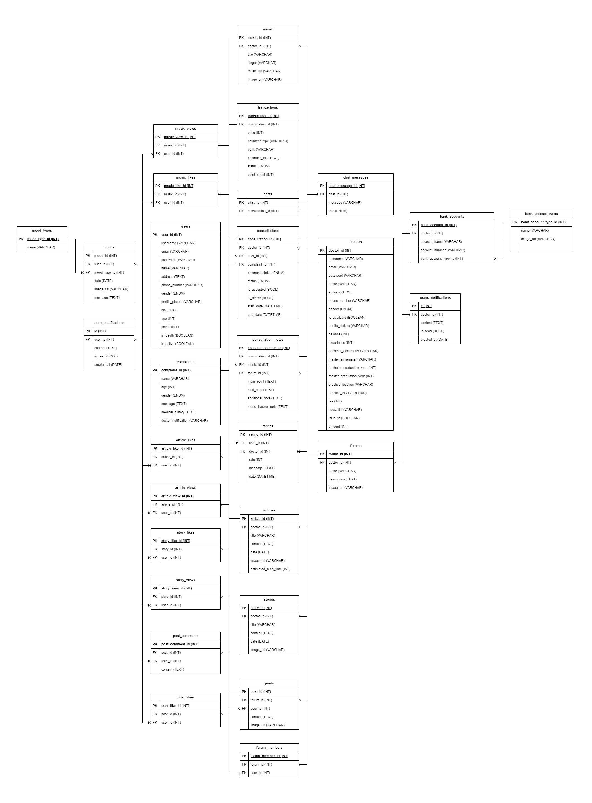
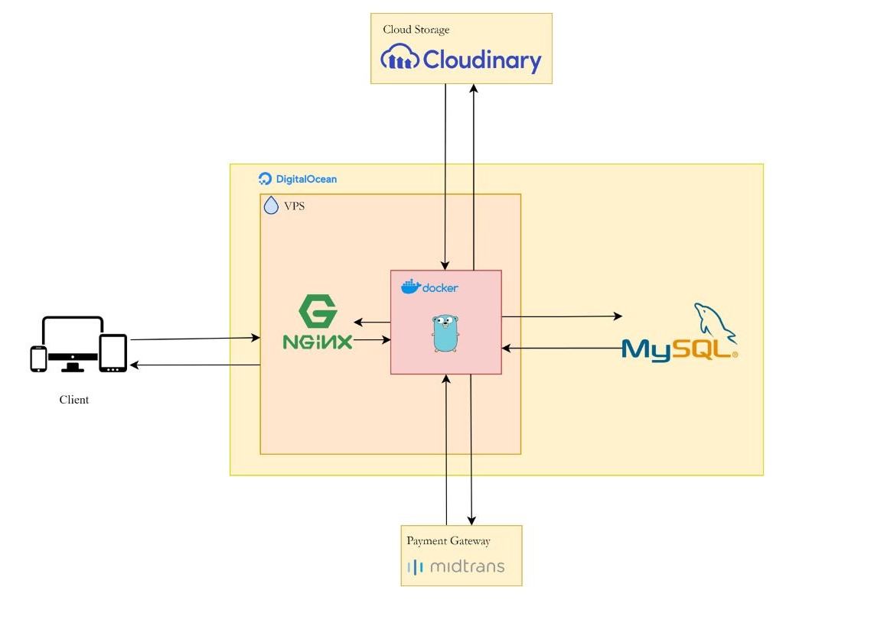

# MINDEASE

<div align="center">
  <a href="https://github.com/Kelompok-6-Capstone-Alterra-2024/backend-golang/assets/MINDEASE.png">
    
  </a>
</div>

>_The meaning of the word "MINDEASE" is peace of mind or peace of mind._


# About Project
MindEase is an app designed to provide mental health support and care. With a primary focus on mental health, MindEase aims to help users manage stress, anxiety, depression, and other mental health issues through the app's various features and services.

# Target Scope
- 🧍 **End User**: Can communicate with psychologists or mental health professionals
- 👨‍⚕️ **Doctors**: Provide recommendations to end users regarding mental health, manage patients, and manage content

# Features:
### USERS FEATURE:
| Method | Feature                                                                                            |
|--------|----------------------------------------------------------------------------------------------------|
| POST   | Register user                                                                                      |
| POST   | Login user                                                                                         |
| GET    | User register and login with google                                                                |
| GET    | User register and login with facebook                                                              |
| PUT    | Send new password                                                                                  |
| POST   | Send mood                                                                                          |
| GET    | Get all moods by user id between range of date                                                     |
| GET    | Get mood by id                                                                                     |
| GET    | Get all doctors                                                                                    |
| GET    | Search doctors                                                                                     |
| GET    | Get all available doctors                                                                          |
| GET    | Get doctor by id                                                                                   |
| GET    | Get all articles                                                                                   |
| GET    | Get article by id                                                                                  |
| GET    | Get liked article by user id                                                                       |
| POST   | Like a articles                                                                                    |
| DELETE | Unlike a articles                                                                                  |
| GET    | Get all musics                                                                                     |
| GET    | Get music by id                                                                                    |
| GET    | Get liked musics by user id                                                                        |
| POST   | Like a music                                                                                       |
| DELETE | Unlike a music                                                                                     |
| GET    | Get all stories                                                                                    |
| GET    | Get story by id                                                                                    |
| GET    | Get liked stories by user id                                                                       |
| POST   | Like a story                                                                                       |
| DELETE | Unlike a story                                                                                     |
| POST   | Create consultation                                                                                |
| GET    | Get all consultations by user id                                                                   |
| GET    | Get consultation by id                                                                             |
| POST   | Send complaint                                                                                     |
| POST   | Pay consultation with payment gateway                                                              |
| POST   | Pay consultation with ewallet (QRIS)                                                               |
| POST   | Pay consultation with Bank Transfer (BCA, BRI, BNI)                                                |
| GET    | Get all chat rooms by user id (status = active or process or completed)                            |
| POST   | Send chat to doctor                                                                                |
| GET    | Get all chat messages by chat_id                                                                   |
| GET    | Get consultation notes by consultation_id                                                          |
| POST   | Send consultation feedback                                                                         |
| GET    | Send messages to customer service chatbot                                                          |
| GET    | Send messages to mental health chatbot                                                             |
| POST   | User join forum                                                                                    |
| DELETE | User leave forum                                                                                   |
| GET    | Get all forums joined by user id                                                                   |
| GET    | Get recommendation forums                                                                          |
| GET    | Get forum by id                                                                                    |
| POST   | Send post in forum                                                                                 |
| GET    | Get all posts by forum id                                                                          |
| GET    | Get post by id                                                                                     |
| POST   | Like a post                                                                                        |
| DELETE | Unlike a post                                                                                      |
| GET    | Get all comments by post id                                                                        |
| POST   | Send comment                                                                                       |
| GET    | Get detailed profile                                                                               |
| PUT    | Update profile                                                                                     |
| PUT    | Change password                                                                                    |
| GET    | Get all transactions pending or success or failed                                                  |
| GET    | Get all transaction by consultation id                                                             |
| GET    | Get Detail Transaction                                                                             |
| GET    | Get points by user id                                                                              |
| POST   | Send otp code to email (for register and forgot password)                                          |
| POST   | Send otp code to email (for change email)                                                          |
| POST   | Verify otp code for forgot password                                                                |
| POST   | Verify otp code for change email                                                                   |
| POST   | verify otp code for register                                                                       |
| GET    | Get All Notification                                                                               |
| DELETE | Delete Notification                                                                                |
| PUT    | Update Status Notification To Read                                                                 |

### DOCTORS FEATURE:
| Method | Feature                                                                                          |
|--------|--------------------------------------------------------------------------------------------------------------------------------------------|
| POST   | Doctors register                                                                                                                           |
| POST   | Doctors login                                                                                                                              |
| GET    | Doctors login and register with google                                                                                                     |
| GET    | Doctors login and register with facebook                                                                                                   |
| PUT    | Verify consultations request. To approve consultation, set the status with ""incoming"".  rejected to ""rejected"". and done with ""done"" |
| GET    | Get all consultations by doctor id                                                                                                         |
| GET    | Get Consultation By ID                                                                                                                     |
| GET    | Get the number of doctor's total consultations (rejected not included)                                                                     |
| POST   | Post Consultation Notes                                                                                                                    |
| GET    | Get all transactions by doctor id                                                                                                          |
| GET    | Get Transaction by ID                                                                                                                      |
| DELETE | Delete transaction by transaction id                                                                                                       |
| GET    | Get the number of transactions by doctor id                                                                                                |
| GET    | Get all patients by doctor id (patients who are still not consulted and have been accepted)                                                     |
| GET    | Search Patients                                                                                                                            |
| GET    | Get patient detail by patient id                                                               |
| POST   | Post article                                                                                                                               |
| GET    | Get all articles                                                                                                                           |
| GET    | Get article by id                                                                                                                          |
| PUT    | Update article by id                                                                                                                       |
| DELETE | Delete article by id                                                                                                                       |
| GET    | Get the number of articles by doctor id                                                                                                    |
| GET    | Get the number of articles likes by doctor id                                                                                              |
| GET    | Get the number of articles views by doctor id                                                                                              |
| GET    | Get the number of articles views month by month according to doctor id                                            |
| POST   | Post story                                                                                                                                 |
| GET    | Get all stories by doctor id                                                                                                               |
| GET    | Get story by id                                                                                                                            |
| PUT    | Update story by id                                                                                                                         |
| DELETE | Delete story by id                                                                                                                         |
| GET    | Get the number of stories by doctor id                                                                                                     |
| GET    | Get the number of stories likes by doctor id                                                                                               |
| GET    | Get the number of stories view count by doctor id                                                                                          |
| GET    | Get the number of stories views month by month according to doctor id                                             |
| POST   | Post music                                                                                                                                 |
| GET    | Get all musics by doctor id                                                                                                                |
| GET    | Get music by id                                                                                                                            |
| PUT    | Update music by id                                                                                                                         |
| DELETE | Delete music by id                                                                                                                         |
| GET    | Get the number of musics by doctor id                                                                                                      |
| GET    | Get the number of musics likes by doctor id                                                                                                |
| GET    | Get the number of musics view by doctor id                                                                                                 |
| GET    | Get the number of musics views month by month according to doctor id                                              |
| POST   | Send message to hatbot to get treatment recommendations                                                                                    |
| GET    | Get all feedbacks by doctor id                                                                                                             |
| GET    | Get all ratings of doctors categorized per star rating along with their averages                                                           |
| POST   | Create forum                                                                                                                               |
| GET    | Get all forums by doctor id                                                                                                                |
| PUT    | Update forum by forum id                                                                                                                   |
| DELETE | Delete forum by forum id                                                                                                                   |
| GET    | Get forum by forum id                                                                                                                      |
| GET    | Get all forum members by forum id                                                                                                          |
| GET    | Get all posts by forum id                                                                                                                  |
| GET    | Get all comments by post id                                                                                                                |
| GET    | Get all chat rooms by doctor id (status can be active, completed or process                                                                |
| POST   | Send chat to user                                                                                                                          |
| GET    | Get all chat messages by chat_id                                                                                                           |
| PUT    | Update doctors profile                                                                                                                     |
| GET    | Get detailed profile                                                                                                                       |
| GET    | Get All Notification                                                                                                                       |
| DELETE | Delete Notification                                                                                                                        |
| PUT    | Update Status Notification To Read                                                                                                         |

# TECH STACK
- [Golang](https://github.com/golang/go) - Go is an open source programming language that makes it easy to build simple, reliable, and efficient software!
- [Echo](https://github.com/labstack/echo) - High performance, extensible, minimalist Go web framework.
- [GORM](https://github.com/go-gorm/gorm) - The fantastic ORM library for Golang, aims to be developer friendly.
- [MySQL](https://www.mysql.com/) - For Database
- [Midtrans](https://midtrans.com/en) - Payment Gateway
- [Cloudinary](https://cloudinary.com/) - Media Management
- And Other library

# Getting Started
Make sure you have Go installed on your machine. You can download it from golang.org.
### Git Clone
```sh
git clone https://github.com/Kelompok-6-Capstone-Alterra-2024/backend-golang.git
```

### Create an `.env` file locally. Or You can duplicate `.env example`
```sh
cp .env.example .env
```

### Install required dependencies
This command ensures that the go.mod file matches the source code in your module's directory, adding any missing dependencies and removing unnecessary ones.
```sh
go mod tidy
```
### Run `main.go`
Execute the following command to run the main.go file:
```sh
go run main.go
```

# Entity Relationship Diagram
<div align="center">
  <a href="https://github.com/Kelompok-6-Capstone-Alterra-2024/backend-golang/assets/ERD.jpg">
    
  </a>
</div>

# High-level architecture
<div align="center">
  <a href="https://github.com/Kelompok-6-Capstone-Alterra-2024/backend-golang/assets/HLA.jpg">
    
  </a>
</div>

# Contributors
**MAHARDIKO CESARTISTA RASENDRIYA**
[](https://github.com/Dikocesrt)
**WAHYUDDIN**
[](https://github.com/wdinx)
**ALFIAN NUR FAZAR RIZKY**
[](https://github.com/hantzord)
